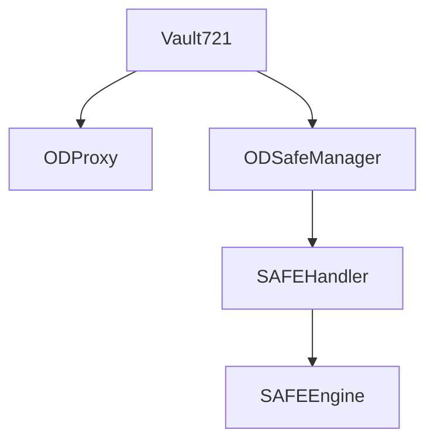

Open Dollar is a decentralized algorithmic stablecoin protocol that aims to maintain a floating $1.00 peg backed by staked ETH and other assets. It utilizes NFT-controlled vaults and an incentive structure to manage the supply and maintain the peg.

### Architecture 

Open Dollar consists of several core smart contracts:

- **Vault721** - ERC721 NFT contract that manages ownership of collateral vaults
- **ODProxy** - Proxy contract through which users interact with their vault 
- **ODSafeManager** - Manages vault operations like deposit/withdraw
- **SAFEHandler** - Per-vault access control granted to ODSafeManager
- **SAFEEngine** - Core protocol engine that tracks vault collateralization

### Key Mechanisms

The main mechanisms for maintaining the peg are:

- **Collateralized vaults** - Vaults are opened with ETH/stETH collateral protecting a stablecoin debt position. This collateral ratio must stay above the liquidation ratio.
- **NFT-controlled vaults** - Each collateral vault is an NFT in Vault721. Transferring the NFT transfers vault ownership and collateral.
- **Floating peg** - The DAO can vote to adjust interest rates to stabilize the peg. Rates incentivize closing vaults when ODX > $1.
- **Liquidations** - Keepers can liquidate undercollateralized vaults to recapitalize the system.

## Analysis 

Overall the core design and architecture seem sound. Here are some areas worth focusing on:

### Centralization Risks

The governor address holds a significant amount of power. It can pause parts of the system and drain funds. Consider implementing a timelock and spread authorization across a multisig to mitigate centralization risk.

### Systemic Risks

Black swan events like long term price decline of ETH could cause severe undercollateralization and cascading liquidations. Implement better stress testing, circuit breakers, diversified collateral, and liquidity provisions to make the system antifragile.

### Potential Attack Vectors

- **Reentrancy** - Use reentrancy guards when modifying state before external calls.
- **Math errors** - Use SafeMath libraries and extensive test cases to avoid underflows and overflows. 
- **Oracle manipulation** - Use a decentralized network of oracles, staking, monitoring, and graceful failovers to secure price feeds.

### Gas Optimization

Several areas such as enumerating user vaults and proxy deployments could be optimized to save gas costs for users.

## Conclusion

Open Dollar has a solid design and architecture. With some added defenses against black swan risks and by following best practices around access control, math, and reentrancy, the system can become resilient and decentralized long-term. 

### Time spent:
15 hours